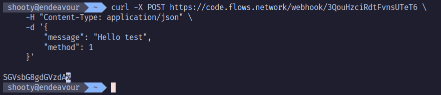
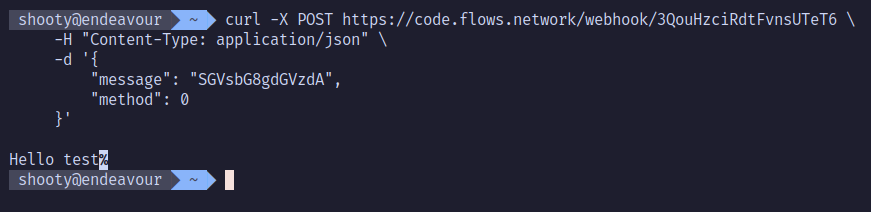

# Simple Base64 Encoder Decoder

Web hook link : https://code.flows.network/webhook/3QouHzciRdtFvnsUTeT6
\
This project is a simple Base64 encoder decoder API
\
The API encodes or decodes a string sent by a POST request where the body is:

```json
{
  "message": "String",
  "method": "int"
}
```

where `method` can take either 0 (decode) or 1 (encode)

```bash
curl -X POST https://code.flows.network/webhook/3QouHzciRdtFvnsUTeT6 -H "Content-Type: application/json" -d '{"message": "Hello test", "method": 1}'
```



and

```bash
curl -X POST https://code.flows.network/webhook/3QouHzciRdtFvnsUTeT6 -H "Content-Type: application/json" -d '{"message": "SGVsbG8gdGVzdA", "method": 0}'
```


